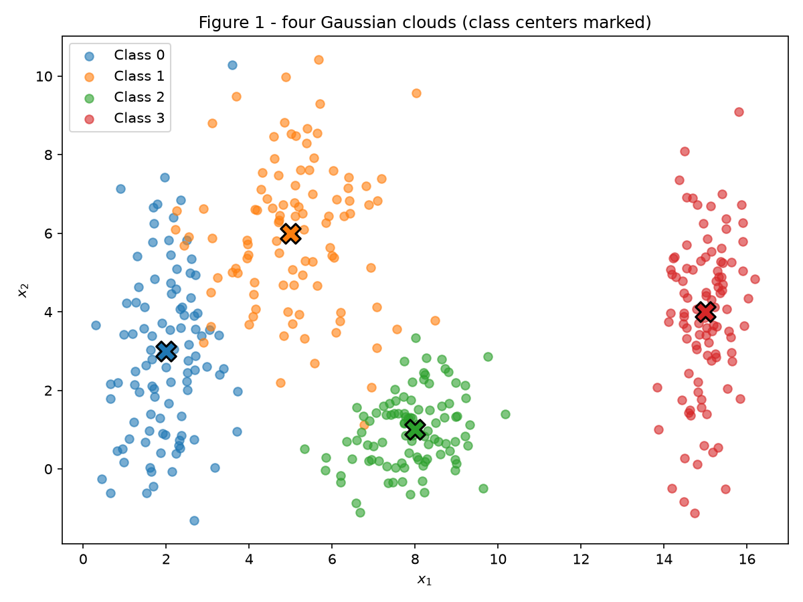
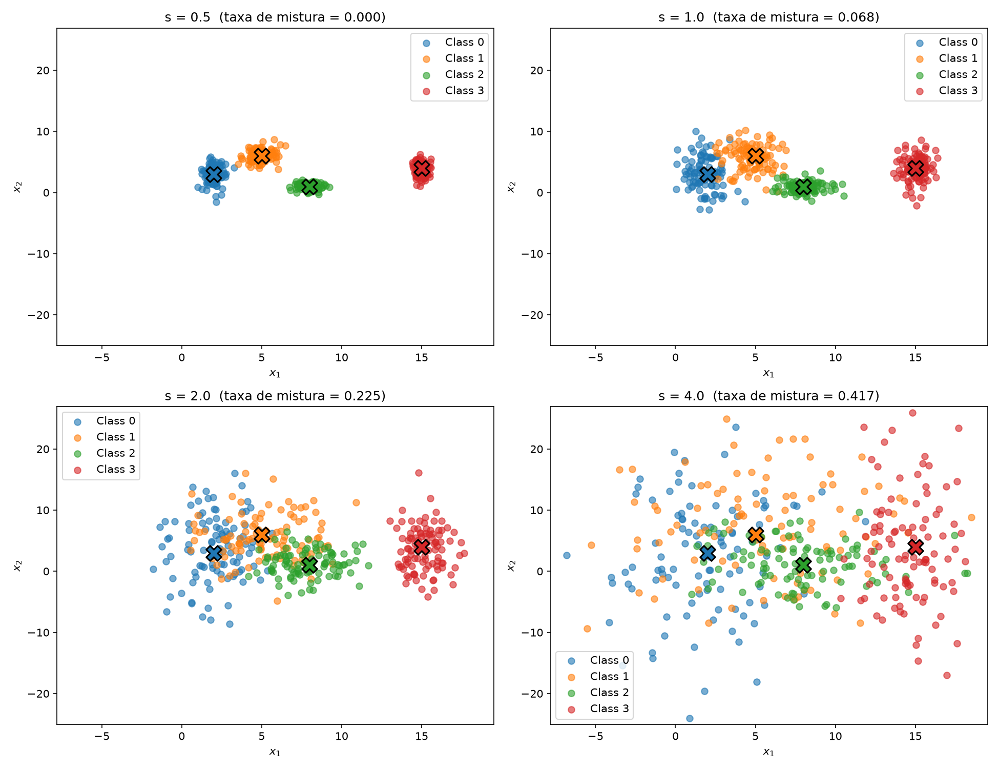
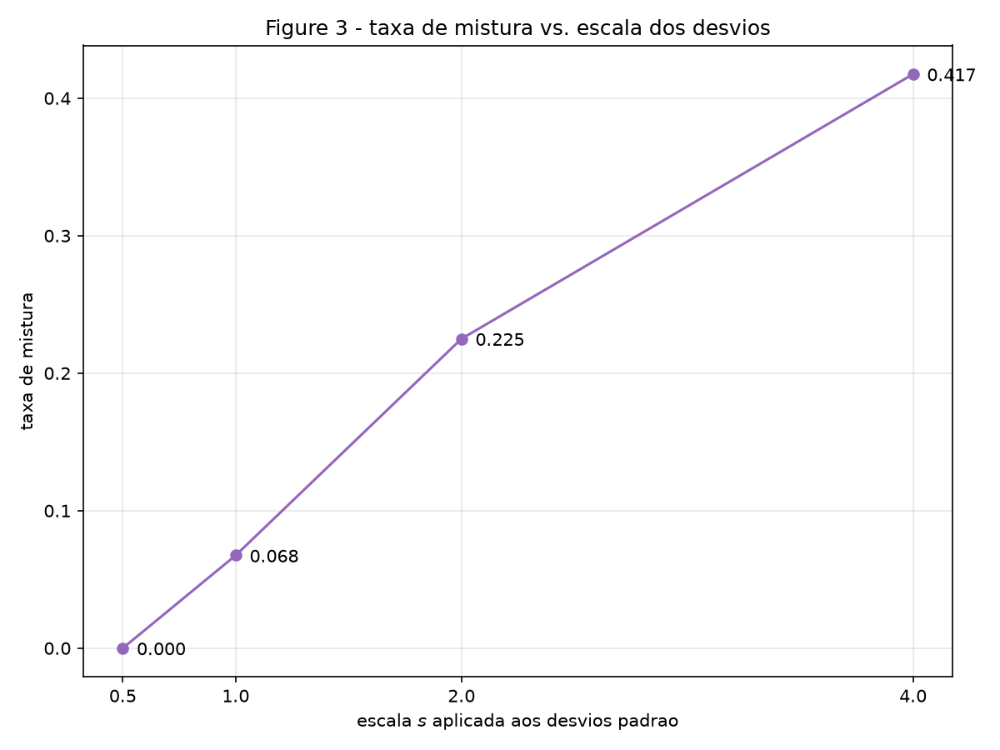
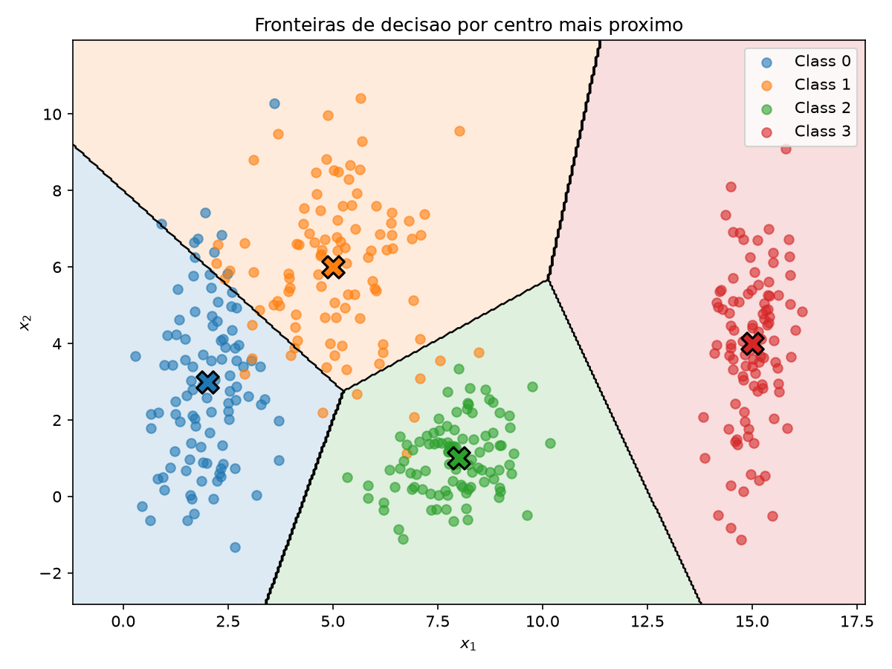
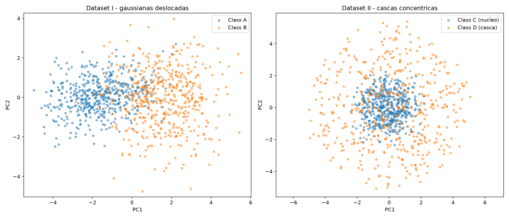
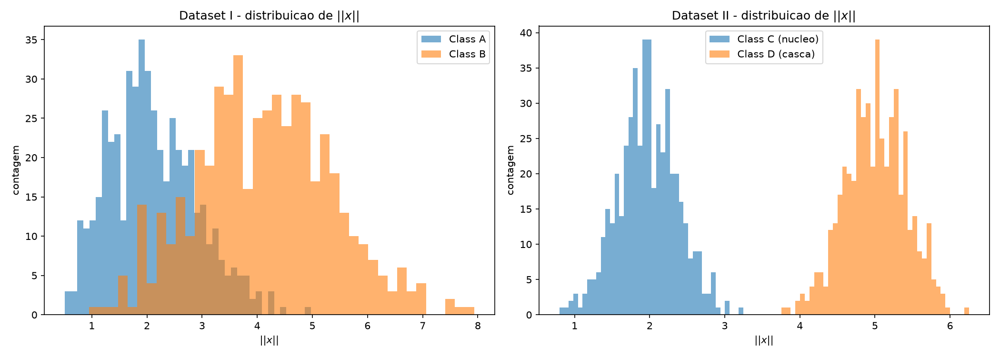

# Exercise 1: Data

## Exercise 1: Point Clouds — Geometry and Spread in 2D

### A — Generate the clouds

Gerei 400 amostras divididas em 4 classes, 100 em cada. Cada classe vem de uma
gaussiana sorteada de forma independente nos dois eixos, com os parâmetros do
enunciado:

| Classe | Média $\mu$ | Desvio padrão $\sigma$ |
|---|---|---|
| 0 | $[2, 3]$ | $[0{,}8,\ 2{,}5]$ |
| 1 | $[5, 6]$ | $[1{,}2,\ 1{,}9]$ |
| 2 | $[8, 1]$ | $[0{,}9,\ 0{,}9]$ |
| 3 | $[15, 4]$ | $[0{,}5,\ 2{,}0]$ |

Como o $\sigma$ é um vetor e não um único número, cada nuvem fica esticada de
um jeito diferente. A classe 0 tem $\sigma = [0{,}8,\ 2{,}5]$, então é estreita
e alta; já a classe 2 tem $\sigma = [0{,}9,\ 0{,}9]$ e sai quase circular.

A função `generate` recebe um argumento `scale` que multiplica todos os desvios
padrão de uma vez. Aqui ele fica em `1.0`, ou seja, uso os valores do enunciado
sem alteração.

``` { .python .copy title="ex1_clouds.py" linenums="1" }
--8<-- "docs/exercises/data/code/ex1_clouds.py"
```

Rodando o script, as dimensões saem como esperado:

```
X shape: (400, 2), y shape: (400,)
pontos por classe: [100 100 100 100]
```


/// caption
**Figura 1** — as quatro nuvens gaussianas. O X preto marca o centro $\mu$ do
enunciado, e não a média dos pontos que foram sorteados.
///

Na figura dá para ver que a classe 3 fica sozinha em $x_1 \approx 15$, longe das
outras. As classes 0 e 1 se sobrepõem na faixa $x_1 \in [3, 4]$, e a classe 2
encosta na parte de baixo da classe 1.

### B — More or less spread out

Repeti a geração quatro vezes, multiplicando todos os desvios padrão por
$s \in \{0{,}5;\ 1{,}0;\ 2{,}0;\ 4{,}0\}$. As médias não mudam, só o
espalhamento.


/// caption
**Figura 2** — as mesmas quatro classes com os desvios multiplicados por $s$.
Os quatro painéis usam os mesmos limites de eixo, calculados sobre todas as
escalas, senão a comparação visual não valeria nada.
///

#### Razão de separação

Para $s = 1$, calculei $r_{ij} = \dfrac{\lVert \mu_i - \mu_j \rVert}{\bar\sigma_i + \bar\sigma_j}$
nos seis pares, usando $\bar\sigma$ como a média dos dois desvios da classe:

| Par | $r_{ij}$ |
|---|---|
| 0 e 1 | **1,326** |
| 1 e 2 | 2,380 |
| 0 e 2 | 2,480 |
| 2 e 3 | 3,542 |
| 1 e 3 | 3,642 |
| 0 e 3 | 4,496 |

O menor é o par **0 e 1**, com $r_{01} = 1{,}326$ — o que bate com o que se vê
na Figura 1, onde são as duas nuvens que se tocam.

Para $s = 2$ a previsão é $0{,}663$, ou seja, metade. O raciocínio é que
escalar $s$ multiplica os desvios mas não mexe nas médias: o numerador de
$r_{ij}$ fica igual e o denominador dobra. Rodando com $s = 2$ o valor dá
exatamente $0{,}663$, confirmando.

#### Taxa de mistura

Calculei a fração de pontos cujo centro verdadeiro mais próximo pertence a outra
classe:

| $s$ | Taxa de mistura |
|---|---|
| 0,5 | 0,000 |
| 1,0 | 0,068 |
| 2,0 | 0,225 |
| 4,0 | 0,417 |


/// caption
**Figura 3** — taxa de mistura em função da escala aplicada aos desvios.
///

Com $s = 0{,}5$ nenhum ponto cai do lado errado: as nuvens ficam tão apertadas
que se separam completamente. A partir daí a mistura cresce rápido, e em
$s = 4$ quase metade dos pontos já está mais perto do centro de outra classe.

Para achar o limiar, usei o $r_{ij}$ do par mais apertado, que é o 0-1. Quando
$r_{01} = 1$, a distância entre os dois centros fica igual à soma dos
espalhamentos médios, ou seja, acabou a faixa livre entre as nuvens. Como
$r_{01}(s) = 1{,}326 / s$, isso dá $s \approx 1{,}33$. Então é entre $s = 1$ e
$s = 2$ que o par 0-1 deixa de ser linearmente separável, o que bate com o salto
da taxa de mistura de 0,068 para 0,225 nesse intervalo.

### C — Analysis

**Como as classes se sobrepõem.** Na Figura 1, a classe 3 fica isolada em
$x_1 \approx 15$ e dá para separar dela com uma reta vertical. O problema são as
classes 0 e 1, que se encostam em $x_1 \in [3, 4]$ — e o $r_{01} = 1{,}326$
confirma que é o par mais apertado dos seis. A classe 2 encosta na parte de
baixo da classe 1, mas com bem mais folga.

Uma reta só não separa as quatro classes. Consigo traçar uma que isola a classe
3, mas aí as outras três ficam todas do mesmo lado, então precisaria de pelo
menos mais uma. E como as nuvens têm formatos bem diferentes (a classe 0 é alta
e estreita, a 2 é quase circular), acho que a fronteira ideal entre elas nem
seria reta.

**Esboço das fronteiras.** Desenhei as fronteiras usando o critério de centro
mais próximo, que foi a divisão mais simples que consegui pensar respeitando os
quatro centros:


/// caption
**Figura 1b** — as mesmas nuvens, com as regiões de decisão do classificador de
centro mais próximo. As linhas pretas são as fronteiras.
///

Dá para ver os pontos que caem do lado errado, quase todos na divisa entre o
azul e o laranja. São exatamente os 6,8% que contei na taxa de mistura para
$s = 1$.

**Ligação com o item B.** Aumentar o espalhamento não muda as fronteiras, já que
elas dependem só das médias. O que muda é quanto de cada nuvem passa para o lado
errado. Em $s = 0{,}5$ as nuvens ficam compactas e nenhum ponto cruza; quando $s$
cresce, as caudas começam a invadir a região vizinha.

Esses pontos que invadem são erro que não tem como evitar: eles caem numa região
onde outra classe é mais provável, então nenhum classificador acerta todos sem
decorar o treino. É isso que a taxa de mistura está medindo, e por isso ela
depende da razão entre distância e espalhamento, e não só da distância.

## Exercise 2: Non-Linearity in Higher Dimensions

### A — Dataset I: shifted Gaussians

Gerei 500 amostras por classe em 5 dimensões, usando normal multivariada. A
classe A fica centrada na origem e a classe B em $[1{,}5;\ 1{,}5;\ 1{,}5;\ 1{,}5;\ 1{,}5]$,
cada uma com a matriz de covariância do enunciado.

As duas matrizes não são iguais: a da classe B tem variâncias maiores (1,5
contra 1,0 na diagonal) e uma correlação negativa entre as duas primeiras
dimensões, enquanto na classe A essa correlação é positiva. Ou seja, além de
estarem em lugares diferentes, as nuvens têm formatos diferentes.

### B — Dataset II: concentric shells

Aqui a estrutura é radial: cada ponto é uma **direção** vezes um **raio**, e eu
sorteio os dois separadamente.

Para a direção, sorteio um vetor $v$ de 5 números tirados de uma normal padrão
e divido ele pelo próprio tamanho: $u = v / \lVert v \rVert$. Isso deixa o vetor
com comprimento 1, ou seja, ele vira só uma direção.

Esse jeito de sortear direção funciona porque a nuvem de pontos que sai de
$v \sim N(0, I_5)$ tem formato de bola: ela é igual em todas as direções, nenhuma
é mais provável que outra. Então, quando eu normalizo, as direções saem
espalhadas por igual.

Não daria certo sortear de qualquer distribuição. Se eu usasse uma uniforme em
$[-1, 1]$ em cada coordenada, estaria amostrando de dentro de um cubo — e cubo
tem mais espaço nas quinas do que no meio das faces, então sobrariam direções
demais apontando para as diagonais.

O raio é o que separa as classes: a classe C (núcleo) tem
$\rho \sim N(2{,}0;\ 0{,}4)$ e a classe D (casca) tem $\rho \sim N(5{,}0;\ 0{,}4)$.
O ponto final é $x = \rho \cdot u$.

No fim isso dá duas cascas esféricas, uma dentro da outra, com o mesmo centro.

### C — Visualize and compare


/// caption
**Figura 4** — projeção PCA dos dois datasets de 5D para 2D, lado a lado.
///

| | Dataset I | Dataset II |
|---|---|---|
| Distância entre os centros | 3,2282 | 0,2662 |
| Variância explicada PC1 + PC2 | 0,6597 | 0,4291 |

A distância entre centros é medida em 5D, entre as médias empíricas das duas
classes. No Dataset I ela dá 3,2282, bem perto do valor teórico
$1{,}5\sqrt{5} = 3{,}3541$ — a diferença é só flutuação amostral.

No Dataset II a distância dá 0,2662, praticamente zero. Faz sentido: as duas
cascas têm o mesmo centro, então as médias das duas classes caem as duas perto
da origem, e o que sobra é ruído de amostragem.

A variância explicada também diz algo. No Dataset I, PC1 sozinha pega 50% — ela
encontrou a direção do deslocamento entre as classes, que é a direção onde tem
mais variância. Já no Dataset II os dois primeiros componentes juntos pegam
42,9%, que é quase exatamente $2/5 = 40\%$. Isso é o que se esperaria se
nenhuma direção fosse especial: com os dados espalhados igualmente pelas 5
dimensões, cada componente carrega mais ou menos um quinto da variância, e o
PCA não tem o que destacar.


/// caption
**Figura 5** — histogramas sobrepostos de $\lVert x \rVert$ para as duas classes
de cada dataset.
///

A Figura 5 mostra a diferença de forma mais clara. No Dataset I os raios das
duas classes se sobrepõem bastante. No Dataset II eles ficam completamente
separados: o raio médio da classe C é 1,97 e o da classe D é 5,00, e no meu
conjunto **nenhum ponto** da classe C tem raio maior que o menor raio da classe D.

### D — Analysis

**Centro junto, raio separado: por que reta não resolve.** Um classificador
linear funciona assim: ele escolhe uma direção e corta o espaço com um plano
perpendicular a ela. Tudo de um lado é uma classe, tudo do outro é a outra.

O problema do Dataset II é que as duas classes têm o mesmo centro e se espalham
igual para todos os lados. Então, escolha a direção que escolher, as duas
classes aparecem centradas no mesmo lugar — qualquer corte que eu fizer vai
pegar metade de cada classe de cada lado. Não existe corte bom.

O que separa as classes não é a direção, é a **distância até o centro**. E
distância não dá para escrever como uma soma das coordenadas com pesos, que é
tudo o que um modelo linear sabe fazer.

**Por que precisa de não-linearidade.** Um perceptron calcula $w \cdot x + b$,
que é só somar as coordenadas multiplicadas por pesos. Não existe escolha de
pesos que produza uma regra do tipo "está a uma distância entre 1,5 e 2,5 do
centro". Para chegar nisso preciso elevar as coordenadas ao quadrado, e isso um
modelo linear não faz — é o que as camadas escondidas com ativação não-linear
resolvem.

**Projeção ruim não prova que não dá para separar.** Olhando a Figura 4, dá para
ver a estrutura do Dataset II: o núcleo azul no meio e a casca laranja em volta.
Mesmo assim, nenhuma reta separa os dois. E a figura ainda engana um pouco:
pontos da casca que estavam longe numa direção que o PCA jogou fora acabam
aparecendo perto do centro, no meio do azul.

O motivo é que o PCA procura as direções onde os dados mais variam, e não as
direções que separam as classes. Como no Dataset II tudo varia igual em toda
direção, ele acabou pegando duas direções quaisquer. Ou seja, o que eu estou
vendo é uma sombra ruim de algo que em 5D separa perfeitamente — e uma sombra
ruim não prova nada.

A prova de que dá para separar é simples: basta olhar
$\lVert x \rVert^2 = x_1^2 + x_2^2 + x_3^2 + x_4^2 + x_5^2$, que é a distância
ao centro elevada ao quadrado. Se eu usasse esse único número no lugar das
componentes principais, as duas classes ficariam separadas por um limiar — que é
exatamente o que a Figura 5 mostra.

## Results Summary

| # | Item | Your value |
|---|------|-----------|
| 1 | Mixing rate at s = 0.5 | 0,000 |
| 2 | Mixing rate at s = 1.0 | 0,068 |
| 3 | Mixing rate at s = 2.0 | 0,225 |
| 4 | Mixing rate at s = 4.0 | 0,417 |
| 5 | Smallest r_ij at s = 1.0, and which pair | 1,326 (par 0-1) |
| 6 | Distance between centers - Dataset I | 3,2282 |
| 7 | Distance between centers - Dataset II | 0,2662 |
| 8 | Explained variance PC1 + PC2 - Dataset I | 0,6597 |
| 9 | Explained variance PC1 + PC2 - Dataset II | 0,4291 |
