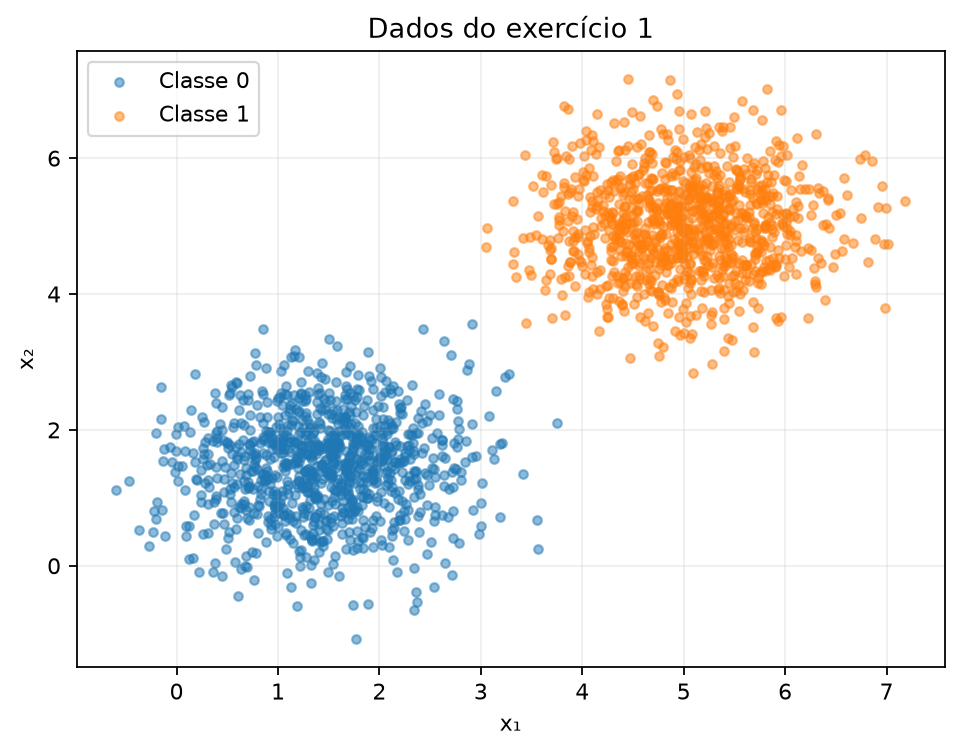
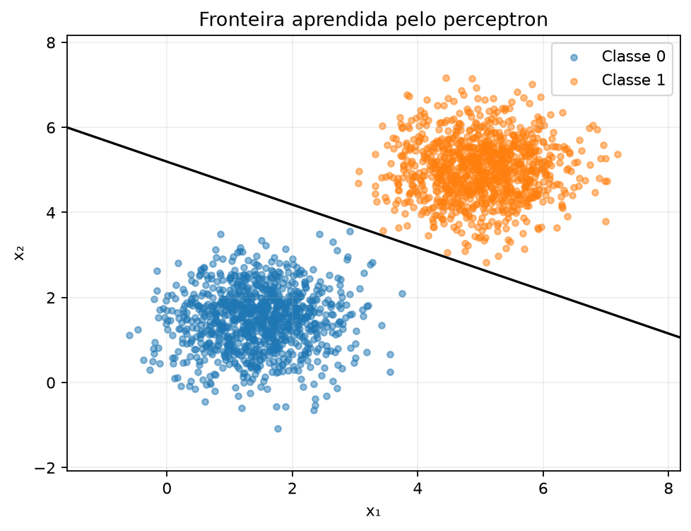
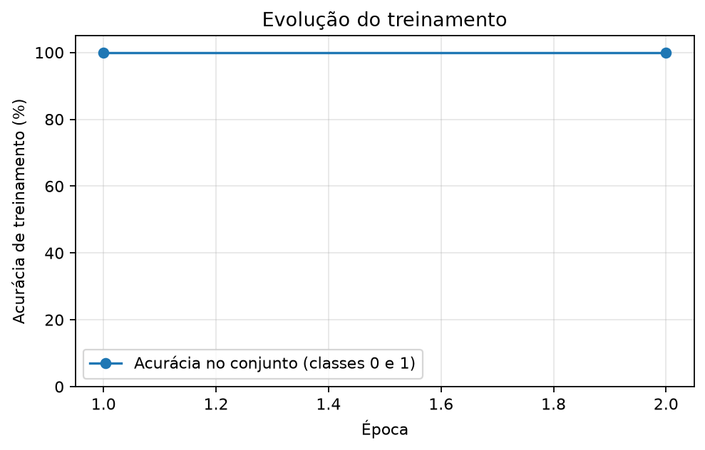

# Perceptron

Este relatório investiga o comportamento de um perceptron na classificação de pontos em duas dimensões. A implementação usa NumPy para operações numéricas e Matplotlib para visualização.

## Exercise 1

### A — Generate the data

Foram gerados 2000 pontos, sendo 1000 de cada classe, a partir de distribuições normais multivariadas:

| Classe | Média | Matriz de covariância |
|---|---|---|
| 0 | [1,5; 1,5] | [[0,5; 0]; [0; 0,5]] |
| 1 | [5; 5] | [[0,5; 0]; [0; 0,5]] |

O gerador foi inicializado uma única vez com `rng = np.random.default_rng(42)` e reutilizado nos sorteios seguintes. Cada linha de `X` corresponde a um ponto, e a mesma posição de `y` contém seu rótulo verdadeiro, 0 ou 1. Os rótulos representam a distribuição de origem dos pontos.



*Figura 1 — Dados do exercício 1. As médias afastadas em relação ao espalhamento resultaram em duas nuvens separadas nesta amostra.*

### B — Implement the perceptron

A predição calcula a combinação linear das entradas:

$$
z = w_1x_1 + w_2x_2 + b.
$$

A função de ativação retorna 1 quando $z \geq 0$ e 0 quando $z < 0$. Para cada amostra, o erro é calculado como $e = y - \hat y$. Se a previsão está correta, o erro é zero e os parâmetros permanecem inalterados. Caso contrário:

$$
w \leftarrow w + \eta e x, \qquad b \leftarrow b + \eta e.
$$

Os dois pesos iniciais foram sorteados com `rng.normal(0, 0.01, size=2)`, resultando em $w_0 = [0{,}002532;\ 0{,}008952]$, de norma $\|w_0\| = 0{,}009303$; o bias foi inicializado em zero. A execução principal utiliza $\eta = 0{,}01$. O treinamento termina ao completar uma época sem atualizações ou atingir 100 épocas. A acurácia é calculada sobre todos os 2000 pontos ao final de cada época.

O treinamento foi organizado na função `treinar_perceptron`. Foram sorteadas previamente 100 permutações dos índices. As mesmas ordens e uma cópia dos mesmos pesos iniciais foram utilizadas na comparação entre as taxas, alterando apenas $\eta$.

```python
--8<-- "docs/exercises/perceptron/code/perceptron_ex1.py"
```

### C — Train and measure

Com $\eta = 0{,}01$, os pesos finais foram **w = [0,00778169; 0,01540104]**, e o bias foi **b = −0,08**. O treinamento terminou após **2 épocas**, com **100% de acurácia** e **zero pontos classificados incorretamente** no conjunto de 2000 pontos.

| Época | Atualizações | Acurácia ao final da época |
|---|---:|---:|
| 1 | 20 | 100% |
| 2 | 0 | 100% |

A fronteira aprendida, com coeficientes arredondados, é:

$$
0{,}00778169x_1 + 0{,}01540104x_2 - 0{,}08 = 0.
$$



*Figura 2 — A reta separa as duas classes. O código marca erros com círculos vermelhos, mas não há erros nesta execução.*



*Figura 3 — A acurácia chega a 100% ao final da primeira época. A segunda passagem confirma a convergência porque não produz atualizações.*

O primeiro ponto da curva corresponde ao final da primeira época, e não ao modelo antes de aprender. Os valores apresentados são acurácias de treinamento, calculadas no conjunto usado para ajustar os parâmetros; não medem desempenho em dados novos.

### D — Analysis

#### 1. Separabilidade e convergência

Nesta amostra, existe uma reta capaz de separar corretamente todos os pontos. A regra de atualização modifica os parâmetros apenas quando há um erro, favorecendo a classe verdadeira do exemplo. Para um conjunto finito linearmente separável, com taxa positiva fixa e apresentações repetidas dos exemplos, o teorema de convergência do perceptron garante um número finito de erros até encontrar uma solução separadora.

Com taxa 0,01, ocorreram 20 atualizações na primeira época e nenhuma na segunda. Ao atingir uma configuração que classifica todos os exemplos corretamente, os erros passam a ser zero e os parâmetros deixam de mudar. A separação entre as nuvens facilita encontrar uma solução neste caso. Isso não implica que o número de atualizações deva diminuir em qualquer treinamento.

#### 2. Comparação das taxas de aprendizado

| Taxa | Pesos finais w | Bias final | Épocas | Acurácia | Atualizações por época |
|---|---|---:|---:|---:|---|
| 0,01 | [0,00778169; 0,01540104] | −0,08 | 2 | 100% | [20; 0] |
| 1,0 | [3,04936399; 2,11995748] | −17,0 | 2 | 100% | [41; 0] |

Para comparar a orientação dos pesos sem o efeito de seu comprimento, foi calculado $w/\|w\|$:

| Taxa | Direção normalizada de w | Norma de w |
|---|---|---:|
| 0,01 | [0,45097303; 0,89253758] | 0,017255 |
| 1,0 | [0,82107421; 0,57082146] | 3,713871 |

As direções diferentes mostram que as fronteiras têm inclinações diferentes, pois o vetor de pesos é perpendicular à reta. O ângulo entre elas é de **28,39°**. Ambas atingiram 100% porque existe mais de uma reta separadora para estes dados.

A taxa controla o tamanho da correção: em um erro, o incremento nos pesos é $\pm\eta x$. Como ambas as execuções partem dos mesmos pesos não nulos, de norma $0{,}009303$, aumentar a taxa altera a importância de cada correção em relação à inicialização. Comparando essa norma com a do vetor final, o peso inicial responde por $0{,}009303 / 0{,}017255 = 54\%$ do resultado com taxa 0,01, e por apenas $0{,}009303 / 3{,}7139 = 0{,}25\%$ com taxa 1,0. Com a taxa menor e apenas 20 correções, o sorteio inicial permanece como metade do vetor final e influencia a direção obtida; com a taxa maior, a primeira correção já o torna desprezível. Isso modifica a trajetória de treinamento e pode mudar quais exemplos serão classificados incorretamente nos passos seguintes.

As duas taxas exigiram duas épocas, mas a taxa 1,0 realizou 41 atualizações, contra 20 com a taxa 0,01. Portanto, neste experimento, aumentar a taxa não reduziu o número de épocas e aumentou a quantidade de correções.

#### 3. Por que a inicialização zerada eliminaria esse efeito?

Considere duas execuções iniciadas em $w=0$ e $b=0$, com taxas positivas $\eta_1$ e $\eta_2$, mesmos dados e mesma ordem de apresentação dos exemplos. Defina $c=\eta_2/\eta_1>0$.

Vamos mostrar por indução que, a cada passo:

$$
w^{(2)}=cw^{(1)}, \qquad b^{(2)}=cb^{(1)}.
$$

No início, a relação vale porque todos os parâmetros são zero. Supondo que ela seja válida antes de processar um exemplo, temos:

$$
z^{(2)}=w^{(2)}\cdot x+b^{(2)}
=c\left(w^{(1)}\cdot x+b^{(1)}\right)=cz^{(1)}.
$$

Como $c$ é positivo, as duas execuções produzem a mesma previsão, inclusive quando $z=0$. Logo, têm o mesmo erro $e=y-\hat y$. Após a atualização:

$$
w_{\mathrm{novo}}^{(2)}=cw^{(1)}+\eta_2ex
=c\left(w^{(1)}+\eta_1ex\right)
=cw_{\mathrm{novo}}^{(1)}.
$$

Analogamente:

$$
b_{\mathrm{novo}}^{(2)}=cb^{(1)}+\eta_2e
=c\left(b^{(1)}+\eta_1e\right)
=cb_{\mathrm{novo}}^{(1)}.
$$

A relação se mantém em todos os passos. Multiplicar todos os coeficientes da equação $w\cdot x+b=0$ pela mesma constante positiva não altera a fronteira nem o lado associado a cada classe. Portanto, em aritmética exata, as duas execuções fariam as mesmas previsões, atualizariam nos mesmos exemplos e terminariam na mesma época. A taxa apenas reescalaria os parâmetros. A inicialização não nula exigida no exercício permite observar um efeito além desse reescalonamento.

## Results summary

As linhas do exercício 2 estão identificadas como pendentes porque esta versão contém apenas o exercício 1. Os pesos são apresentados arredondados a oito casas decimais; o código mantém a precisão dos cálculos.

| # | Quantity | Value |
|---|---|---|
| 1 | Exercise 1 — final w and b | w = [0,00778169; 0,01540104]; b = −0,08 |
| 2 | Exercise 1 — epochs to convergence | 2 |
| 3 | Exercise 1 — final accuracy | 100% |
| 4 | Exercise 1 — epochs and final accuracy with η = 1.0 | 2 épocas; 100% |
