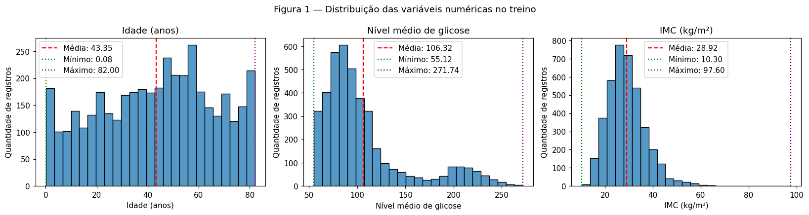
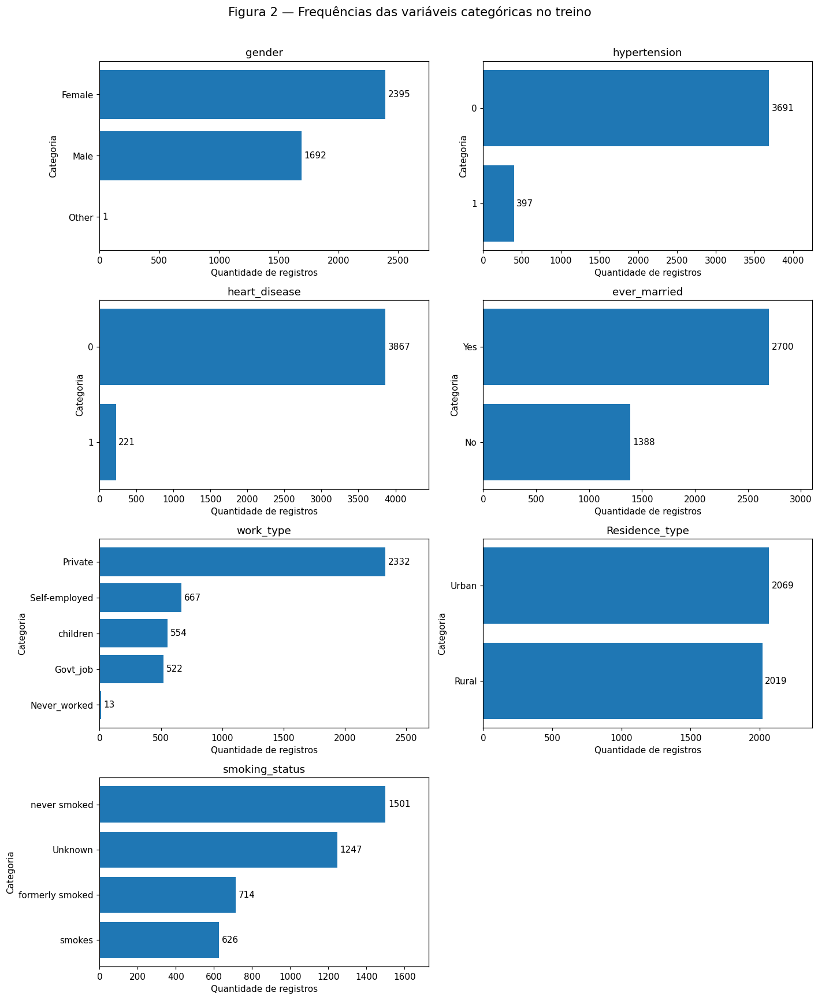
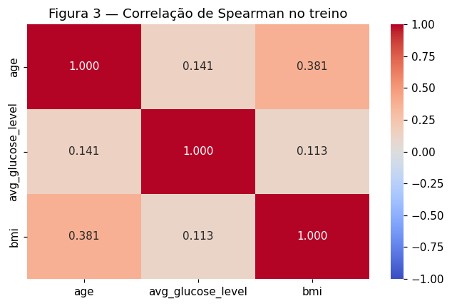
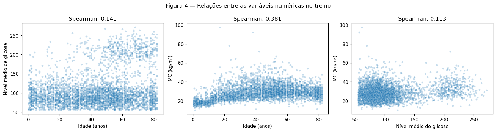
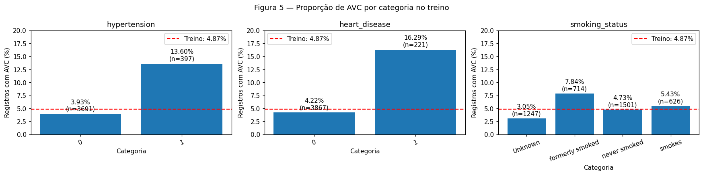
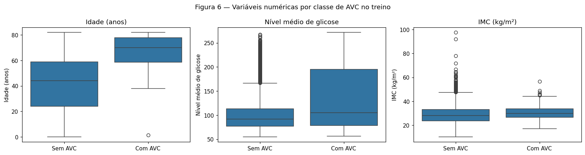
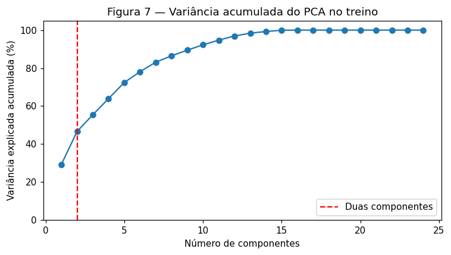
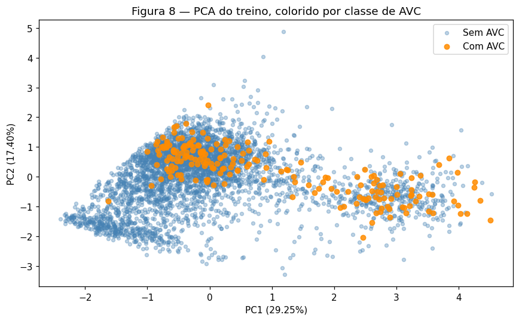
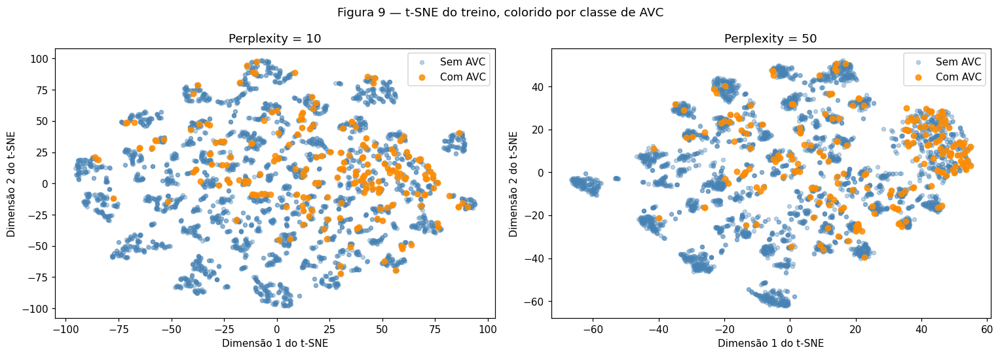
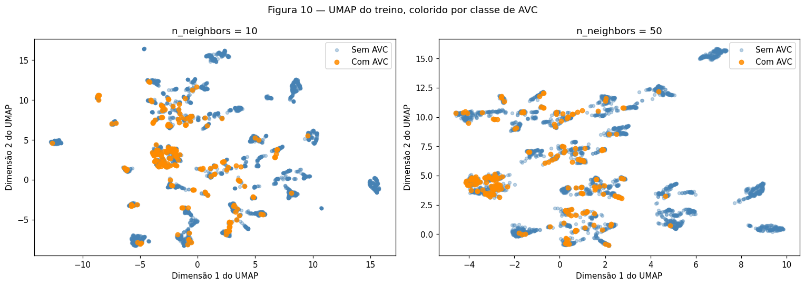

# Análise exploratória — Stroke Prediction Dataset

**Dupla:** Iara Vivian e Vinicius Miranda

## 1. Inspeção inicial

### A. Dicionário de dados

Fonte: [Stroke Prediction Dataset, disponibilizado por fedesoriano no Kaggle](https://www.kaggle.com/datasets/fedesoriano/stroke-prediction-dataset/data). Cada linha corresponde a um registro individual descrito pelas variáveis abaixo. A procedência clínica original, a amostragem e o momento de medição das características não foram confirmados nesta análise; isso limita interpretações de generalização e de previsão temporal.

| Coluna | Significado | Tipo analítico | Unidade / categorias |
|---|---|---|---|
| id | Identificador do registro | Identificador inteiro | Sem unidade |
| gender | Gênero registrado | Categórica nominal | Female, Male, Other |
| age | Idade | Numérica | Anos, incluindo frações |
| hypertension | Indicador de hipertensão | Categórica binária | 0 / 1 |
| heart_disease | Indicador de doença cardíaca | Categórica binária | 0 / 1 |
| ever_married | Já foi casado(a) | Categórica binária | No / Yes |
| work_type | Categoria ocupacional registrada | Categórica nominal | Private, Self-employed, Govt_job, children, Never_worked |
| Residence_type | Tipo de residência | Categórica nominal | Rural / Urban |
| avg_glucose_level | Nível médio de glicose | Numérica | Unidade não confirmada na documentação consultada |
| bmi | Índice de massa corporal | Numérica | kg/m² |
| smoking_status | Situação de tabagismo | Categórica nominal | never smoked, formerly smoked, smokes, Unknown |
| stroke | Registro de AVC: alvo | Categórica binária | 0: sem AVC; 1: com AVC |

`children` foi preservada como categoria original: não há regra confirmada que permita reconstruí-la por um corte de idade. `Unknown` indica informação não conhecida e não equivale a nunca ter fumado.

### B. Qualidade

A base tem **5.110 linhas e 12 colunas**. Há 10 preditores: 3 numéricos e 7 categóricos. O identificador e o alvo completam as 12 colunas.

**Tabela 1 — Ausências e cardinalidade na base completa.**

| index | ausentes | ausentes_pct | valores_distintos |
| --- | --- | --- | --- |
| id | 0 | 0.00 | 5110 |
| gender | 0 | 0.00 | 3 |
| age | 0 | 0.00 | 104 |
| hypertension | 0 | 0.00 | 2 |
| heart_disease | 0 | 0.00 | 2 |
| ever_married | 0 | 0.00 | 2 |
| work_type | 0 | 0.00 | 5 |
| Residence_type | 0 | 0.00 | 2 |
| avg_glucose_level | 0 | 0.00 | 3979 |
| bmi | 201 | 3.93 | 418 |
| smoking_status | 0 | 0.00 | 4 |
| stroke | 0 | 0.00 | 2 |

O IMC apresenta **201 ausências (3,93%)**. Não há `NaN` nas demais colunas, mas `Unknown` em tabagismo representa uma ausência semântica. Foram encontradas **0 linhas duplicadas, 0 IDs repetidos e 0 duplicatas após excluir o ID**. Não há colunas constantes. `id` foi excluído dos preditores por ser identificador, e `stroke` foi separado como alvo. Nenhuma outra coluna é uma cópia explícita do alvo; a falta de informação temporal impede descartar vazamento por medições posteriores ao AVC.

Como verificações básicas de domínio na base completa, houve **0 valores negativos em idade, glicose e IMC** e **0 valores fora de {0, 1} em hypertension, heart_disease e stroke**. 

A inspeção de extremos no treino identificou IMC máximo de **97,6** e um registro com AVC aos **1,32 anos**. Foram mantidos por não haver evidência documental suficiente para classificá-los como erros.
### C. Alvo

**Tabela 2 — Frequências do alvo na base completa.**

| stroke | quantidade | percentual |
| --- | --- | --- |
| 0 | 4861 | 95.13 |
| 1 | 249 | 4.87 |

São **249 registros com AVC (4,87%)** e **4.861 sem AVC (95,13%)**, aproximadamente 19,5 negativos por positivo. Uma regra que sempre escolhesse a maioria atingiria 95,13% de acurácia sem identificar nenhum caso positivo; por isso, acurácia isolada será inadequada na futura modelagem.

### D. Treino e teste

A divisão foi estratificada por `stroke`, com **80% para treino (4.088 registros)** e **20% para teste (1.022)**, usando `random_state=42`, antes de estimar imputação, escala e projeções. O treino contém **199 positivos e 3.889 negativos**; o teste, **50 positivos e 972 negativos**. As demais análises e decisões abaixo utilizam somente o treino.

**Tabela 3 — Proporções preservadas na divisão.**

| stroke | base (%) | treino (%) | teste (%) |
| --- | --- | --- | --- |
| 0 | 95.13 | 95.13 | 95.11 |
| 1 | 4.87 | 4.87 | 4.89 |

## 2. Análise univariada

### A. Numéricas

**Tabela 4 — Estatísticas descritivas do treino.**

| index | age | avg_glucose_level | bmi |
| --- | --- | --- | --- |
| count | 4088.00 | 4088.00 | 3918.00 |
| mean | 43.35 | 106.32 | 28.92 |
| std | 22.60 | 45.26 | 7.93 |
| min | 0.080 | 55.12 | 10.30 |
| 25% | 26.00 | 77.31 | 23.60 |
| 50% | 45.00 | 91.94 | 28.00 |
| 75% | 61.00 | 114.20 | 33.10 |
| max | 82.00 | 271.74 | 97.60 |

Idade tem média **43,35**, mediana **45** e desvio padrão **22,60 anos**. Glicose tem média **106,32**, mediana **91,945** e desvio **45,26**; IMC tem média **28,92**, mediana **28** e desvio **7,93**. As assimetrias são, respectivamente, **−0,155, 1,557 e 1,116**. Histogramas foram escolhidos para examinar formato, caudas e possíveis concentrações.



**Conclusão da Figura 1.** Idade apresenta distribuição ampla e assimetria pequena. Glicose e IMC têm caudas à direita; a glicose apresenta uma concentração adicional de valores elevados. Isso motiva imputação pela mediana e escala robusta, sem assumir normalidade ou excluir automaticamente extremos.

### B. Categóricas

**Tabela 5 — Frequências e cardinalidades no treino.**

| Variável | Cardinalidade | Categoria | Quantidade | Percentual |
| --- | --- | --- | --- | --- |
| gender | 3 | Female | 2395 | 58.59 |
| gender | 3 | Male | 1692 | 41.39 |
| gender | 3 | Other | 1 | 0.024 |
| hypertension | 2 | 0 | 3691 | 90.29 |
| hypertension | 2 | 1 | 397 | 9.71 |
| heart_disease | 2 | 0 | 3867 | 94.59 |
| heart_disease | 2 | 1 | 221 | 5.41 |
| ever_married | 2 | Yes | 2700 | 66.05 |
| ever_married | 2 | No | 1388 | 33.95 |
| work_type | 5 | Private | 2332 | 57.05 |
| work_type | 5 | Self-employed | 667 | 16.32 |
| work_type | 5 | children | 554 | 13.55 |
| work_type | 5 | Govt_job | 522 | 12.77 |
| work_type | 5 | Never_worked | 13 | 0.318 |
| Residence_type | 2 | Urban | 2069 | 50.61 |
| Residence_type | 2 | Rural | 2019 | 49.39 |
| smoking_status | 4 | never smoked | 1501 | 36.72 |
| smoking_status | 4 | Unknown | 1247 | 30.50 |
| smoking_status | 4 | formerly smoked | 714 | 17.47 |
| smoking_status | 4 | smokes | 626 | 15.31 |



**Conclusão da Figura 2.** As cardinalidades variam de 2 a 5, permitindo one-hot encoding sem grande expansão. Other possui apenas 1 registro (0,02%) e Never_worked 13 (0,32%). Unknown reúne 1.247 registros (30,50%) de tabagismo. Não há preditores categóricos de alta cardinalidade; as categorias raras exigem cautela nas comparações.

## 3. Análise bivariada e multivariada

### A. Numéricas × numéricas

Foi usada correlação de Spearman para resumir associações monotônicas por postos, considerando as caudas de glicose e IMC. Ela não pressupõe relação linear e não resume todos os padrões não monotônicos. Pares com IMC ausente usam apenas observações disponíveis.



**Conclusão da Figura 3.** O maior coeficiente é idade × IMC (0,381), seguido de idade × glicose (0,141) e glicose × IMC (0,113). Não foi encontrada associação monotônica forte que justificasse excluir um desses preditores por redundância.



**Conclusão da Figura 4.** Os diagramas permitem observar padrões que o coeficiente não resume: a relação idade–IMC varia ao longo da idade, e valores elevados de glicose coexistem com ampla dispersão. Nenhum par foi tratado como equivalente.

### B. Categóricas × alvo

**Tabela 6 — Proporção de AVC dentro de cada categoria.**

| Variável | Categoria | Total | Casos AVC | AVC (%) |
| --- | --- | --- | --- | --- |
| gender | Female | 2395 | 112 | 4.68 |
| gender | Male | 1692 | 87 | 5.14 |
| gender | Other | 1 | 0 | 0.00 |
| hypertension | 0 | 3691 | 145 | 3.93 |
| hypertension | 1 | 397 | 54 | 13.60 |
| heart_disease | 0 | 3867 | 163 | 4.22 |
| heart_disease | 1 | 221 | 36 | 16.29 |
| ever_married | No | 1388 | 23 | 1.66 |
| ever_married | Yes | 2700 | 176 | 6.52 |
| work_type | Govt_job | 522 | 28 | 5.36 |
| work_type | Never_worked | 13 | 0 | 0.00 |
| work_type | Private | 2332 | 115 | 4.93 |
| work_type | Self-employed | 667 | 55 | 8.25 |
| work_type | children | 554 | 1 | 0.181 |
| Residence_type | Rural | 2019 | 91 | 4.51 |
| Residence_type | Urban | 2069 | 108 | 5.22 |
| smoking_status | Unknown | 1247 | 38 | 3.05 |
| smoking_status | formerly smoked | 714 | 56 | 7.84 |
| smoking_status | never smoked | 1501 | 71 | 4.73 |
| smoking_status | smokes | 626 | 34 | 5.43 |




**Conclusão da Figura 5.** A proporção de AVC é 13,60% com hipertensão contra 3,93% sem; para doença cardíaca, 16,29% contra 4,22%. Ex-fumantes apresentam 7,84%. A linha vermelha indica 4,87% no treino. São associações observacionais, potencialmente confundidas por idade e outras características; não demonstram causalidade.

As diferenças por gênero (4,68% em Female e 5,14% em Male) e residência (4,51% Rural e 5,22% Urban) são menores. Já casamento (6,52% Yes contra 1,66% No) e ocupação (8,25% Self-employed; 0,18% children) podem refletir diferentes perfis etários. Zero casos em Other e Never_worked não demonstra ausência de possibilidade de AVC, dadas suas pequenas amostras.

### C. Numéricas × categóricas

O alvo binário é a variável categórica usada para agrupar os boxplots.

**Tabela 7 — Estatísticas das numéricas por classe.**

| index | 0 | 1 |
| --- | --- | --- |
| age / count | 3889.00 | 199.00 |
| age / median | 44.00 | 70.00 |
| age / mean | 42.11 | 67.66 |
| age / std | 22.31 | 11.88 |
| avg_glucose_level / count | 3889.00 | 199.00 |
| avg_glucose_level / median | 91.65 | 104.86 |
| avg_glucose_level / mean | 105.03 | 131.39 |
| avg_glucose_level / std | 43.85 | 62.13 |
| bmi / count | 3756.00 | 162.00 |
| bmi / median | 27.95 | 29.90 |
| bmi / mean | 28.85 | 30.59 |
| bmi / std | 7.98 | 6.40 |



**Conclusão da Figura 6.** O grupo com AVC tem idade mediana de 70 anos contra 44 sem AVC, e desvio menor (11,88 contra 22,31). Na glicose, mediana e dispersão são maiores com AVC: 104,86 e desvio 62,13 contra 91,65 e 43,85. IMC difere menos em localização (29,90 contra 27,95), com ampla sobreposição e desvio menor com AVC (6,40 contra 7,98). O IMC usa 162 positivos e 3.756 negativos preenchidos.

## 4. Pré-processamento

### A. Estratégias

**Tabela 8 — Extremos pelo critério de 1,5 IQR, estimado no treino.**

| index | limite_inferior | limite_superior | quantidade | pct_dos_preenchidos |
| --- | --- | --- | --- | --- |
| age | -26.50 | 113.50 | 0 | 0.00 |
| avg_glucose_level | 21.98 | 169.53 | 503 | 12.30 |
| bmi | 9.35 | 47.35 | 90 | 2.30 |

Os percentuais usam apenas valores preenchidos. Há **569 registros** extremos em pelo menos uma variável (13,92% do treino), incluindo sobreposição entre glicose e IMC. Foram **removidas ou limitadas 0 linhas**. Os 503 extremos de glicose contêm 66 positivos (13,12%), contra 133 em 3.585 registros dentro dos limites (3,71%). Excluí-los retiraria 33,17% dos positivos do treino; não há comprovação de erro que justifique isso. No IMC, 90 extremos contêm 3 positivos (3,33%).

- **Ausências:** imputação numérica pela mediana do treino, motivada pelas caudas e pelos 170 IMCs ausentes no treino. As medianas aprendidas foram idade 45, glicose 91,945 e IMC 28. Apenas IMC precisou ser preenchido. Entre os IMCs ausentes há 37 positivos (21,76%); o indicador binário de ausência preserva esse padrão sem usar o alvo na imputação. A ausência pode refletir o processo de coleta, limitando a generalização.
- **Extremos:** preservação dos registros, documentando os valores suspeitos e mantendo a possibilidade de auditoria da fonte. Não foi aplicada transformação logarítmica nem clipping.
- **Codificação:** one-hot para as sete categóricas, incluindo os indicadores binários; Unknown permanece uma categoria explícita. `handle_unknown="ignore"` representa categoria inédita com zeros no bloco correspondente, sem alterar a quantidade de colunas. Na divisão utilizada, todas as categorias do teste já aparecem no treino.
- **Escala:** RobustScaler nas numéricas, subtraindo a mediana e dividindo pelo IQR do treino. As amplitudes distintas e os extremos das Figuras 1 e 6 motivam a escolha para a futura rede neural. Esse procedimento não elimina extremos nem garante variâncias iguais; a escala ainda influencia o SMOTENC e as projeções. Colunas one-hot e indicador permanecem em 0/1.

**Balanceamento — SMOTENC aplicado somente ao treino.** Conforme orientação do professor, a reamostragem já integra esta entrega. A proporção de **4,87%** de positivos motiva ampliar sua representação para os próximos passos. Utilizou-se **SMOTENC**, variante de SMOTE para características numéricas e categóricas, em vez de interpolar diretamente as colunas one-hot com SMOTE convencional. Duplicação aleatória e pesos de classe são alternativas que poderão ser comparadas na modelagem; não foram avaliadas por desempenho nesta EDA.

Para gerar os exemplos, as três numéricas entram imputadas e escaladas com os parâmetros do treino original; as sete categóricas mantêm seus valores originais e o indicador de ausência de IMC é declarado categórico binário. O método usa **`sampling_strategy=1.0`, `k_neighbors=5` e `random_state=42`**. A proporção 1:1 é uma configuração inicial, não um ótimo demonstrado. Depois da reamostragem, as categorias são transformadas pelo encoder já ajustado no treino original, mantendo as mesmas 24 colunas.

**Tabela 8A — Classes antes e depois do SMOTENC e conjunto de teste.**

| Conjunto | Sem AVC | Com AVC | Total | AVC (%) |
|---|---:|---:|---:|---:|
| Treino original | 3.889 | 199 | 4.088 | 4,87 |
| Treino balanceado | 3.889 | 3.889 | 7.778 | 50,00 |
| Teste original | 972 | 50 | 1.022 | 4,89 |

Foram gerados **3.690 exemplos positivos sintéticos**. O SMOTENC equilibra as contagens, mas não garante separabilidade, melhora preditiva ou coerência clínica de todas as combinações geradas. A avaliação futura deve usar pacientes reais e comparar estratégias na validação. Os registros sintéticos não são novos pacientes observados e não entram nas estatísticas da EDA.

**Fluxo e prevenção de vazamento.** A divisão treino/teste antecede todos os ajustes. Imputação, escala e categorias do encoder são aprendidas no treino original; o SMOTENC utiliza somente esse treino e seus rótulos. O teste passa apenas por `transform` e não é reamostrado. Em validação futura, a divisão de treino/validação deve ocorrer antes dessas operações, repetindo os ajustes e a reamostragem apenas na parte de treino de cada dobra. Não se deve dividir o conjunto já balanceado para avaliar o modelo.

### B. Redução de dimensionalidade

As projeções usam as mesmas **24 características transformadas dos 4.088 pacientes originais do treino**, por meio de `X_train_t` e `y_train`. O alvo serve somente para colorir os pontos. O conjunto balanceado (`X_train_balanceado_t`, `y_train_balanceado`) é uma saída adicional para a futura modelagem; seus exemplos sintéticos não entram nas Figuras 7–10. Isso mantém a leitura da estrutura observada nos pacientes reais.

**PCA.** PC1 explica 29,25% e PC2 17,40%, totalizando **46,65%**. São necessários 7 componentes para ultrapassar 80% (83,11%) e 12 para ultrapassar 95% (96,89%).



**Conclusão da Figura 7.** Duas dimensões deixam 53,35% da variância fora da visualização. A curva mostra que vários componentes adicionais são necessários para representar a maior parte da dispersão. Variância explicada não é acurácia nem capacidade de explicar o alvo.

**Tabela 9 — Pesos das variáveis nos dois primeiros componentes (todos os coeficientes).**

| index | PC1 | PC2 |
| --- | --- | --- |
| num__age | 0.257 | 0.366 |
| num__avg_glucose_level | 0.868 | -0.482 |
| num__bmi | 0.297 | 0.561 |
| bmi_ausente__missingindicator_bmi | 0.015 | -0.007 |
| cat__gender_Female | -0.014 | 0.082 |
| cat__gender_Male | 0.014 | -0.081 |
| cat__gender_Other | 0.00 | -0.00 |
| cat__hypertension_0 | -0.061 | -0.040 |
| cat__hypertension_1 | 0.061 | 0.040 |
| cat__heart_disease_0 | -0.037 | -0.006 |
| cat__heart_disease_1 | 0.037 | 0.006 |
| cat__ever_married_No | -0.161 | -0.292 |
| cat__ever_married_Yes | 0.161 | 0.292 |
| cat__work_type_Govt_job | 0.016 | 0.031 |
| cat__work_type_Never_worked | -0.002 | -0.003 |
| cat__work_type_Private | 0.048 | 0.139 |
| cat__work_type_Self-employed | 0.039 | 0.055 |
| cat__work_type_children | -0.102 | -0.223 |
| cat__Residence_type_Rural | -0.004 | -0.020 |
| cat__Residence_type_Urban | 0.004 | 0.020 |
| cat__smoking_status_Unknown | -0.102 | -0.205 |
| cat__smoking_status_formerly smoked | 0.043 | 0.056 |
| cat__smoking_status_never smoked | 0.038 | 0.103 |
| cat__smoking_status_smokes | 0.021 | 0.046 |

PC1 é dominado pela glicose (0,868), com contribuições positivas de IMC (0,297) e idade (0,257). PC2 contrapõe IMC (0,561) e idade (0,366) à glicose (−0,482). Os valores são coeficientes sobre entradas transformadas e centradas pelo PCA, não percentuais de importância para AVC. Os sinais dos eixos podem ser invertidos sem mudar a projeção. Dependências entre colunas one-hot explicam componentes sem variância adicional.



**Conclusão da Figura 8.** Há ampla sobreposição entre as classes; os positivos aparecem sobretudo na região superior da nuvem central e em PC1 elevado. A ausência de separação nesta projeção não prova ausência de sinal preditivo nas demais dimensões.

**t-SNE.** Foram comparadas perplexidades 10 e 50, com inicialização PCA, taxa de aprendizado automática e semente 42.



**Conclusão da Figura 9.** Perplexidade 10 apresenta muitos pequenos agrupamentos; 50 organiza estruturas visualmente mais amplas. Há concentrações locais de positivos, mas eles permanecem misturados aos negativos. Contagens seriam necessárias para comparar proporções entre regiões.

**UMAP.** Foram comparados 10 e 50 vizinhos, mantendo `min_dist=0.1`, distância euclidiana e semente 42.



**Conclusão da Figura 10.** As duas configurações apresentam agrupamentos com diferentes concentrações visuais de AVC. Com 50 vizinhos aparecem estruturas mais alongadas; a disposição muda com o parâmetro. Não foi verificado se grupos visualmente parecidos nos dois painéis contêm os mesmos indivíduos.

**Comparação.** Os métodos não lineares tornam visíveis agrupamentos locais menos destacados pelo PCA. Isso não valida subgrupos clínicos: a estrutura também depende da codificação categórica, da escala e dos parâmetros. Tamanhos e distâncias entre grupos em t-SNE e UMAP não possuem interpretação direta; seus eixos não têm significado clínico. Nenhuma projeção mostrou separação completa entre as classes. As 24 características foram mantidas como saída do pipeline; nenhuma projeção 2D foi escolhida como entrada definitiva de um classificador.

### C. Pipeline

O módulo [preprocessing.py](code/preprocessing.py) fornece `build_preprocessor()`, com Pipeline numérica e ColumnTransformer, e `balance_training()`, que aplica SMOTENC usando os componentes já ajustados do pré-processador. O script ajusta o pré-processador apenas em `X_train`; `X_test` passa somente por `transform`. A função de balanceamento retorna a matriz balanceada, os rótulos correspondentes e o sampler, sem reajustar os parâmetros com exemplos sintéticos.

As saídas são **treino original (4.088, 24)**, **treino balanceado (7.778, 24)** e **teste (1.022, 24)**, com **0 NaN nas três matrizes**. A ordem e os nomes das 24 características são os mesmos: 3 numéricas, 1 indicador de ausência e 20 colunas one-hot. O script verifica valores finitos, contagens por classe e se cada bloco one-hot do treino balanceado mantém uma única categoria ativa.

**Nomes das características finais:**

```text
num__age
num__avg_glucose_level
num__bmi
bmi_ausente__missingindicator_bmi
cat__gender_Female
cat__gender_Male
cat__gender_Other
cat__hypertension_0
cat__hypertension_1
cat__heart_disease_0
cat__heart_disease_1
cat__ever_married_No
cat__ever_married_Yes
cat__work_type_Govt_job
cat__work_type_Never_worked
cat__work_type_Private
cat__work_type_Self-employed
cat__work_type_children
cat__Residence_type_Rural
cat__Residence_type_Urban
cat__smoking_status_Unknown
cat__smoking_status_formerly smoked
cat__smoking_status_never smoked
cat__smoking_status_smokes
```

Código importável utilizado:

```python
--8<-- "docs/projects/eda/code/preprocessing.py"
```

O [script completo](code/eda.py) reproduz as tabelas e figuras. Para executá-lo, instale `requirements-eda.txt` (na raiz do repositório) e rode `python docs/projects/eda/code/eda.py`; o CSV está em `data/` e seus caminhos são relativos ao próprio script.

## 5. Síntese

Idade apresenta a maior diferença de localização entre classes (Tabela 7); hipertensão e doença cardíaca têm proporções de AVC acima do conjunto (Tabela 6). Glicose elevada e ausência de IMC também distinguem subconjuntos com mais positivos (seção 4A). As Figuras 8–10 mostram que esses padrões coexistem com ampla mistura de classes.

| Risco para modelagem | Evidência | Plano |
|---|---|---|
| Desbalanceamento | Apenas 199 positivos no treino | Validação estratificada; avaliar precision, recall, F1, curva precisão–recall e matriz de confusão. SMOTENC já implementado: 3.889 registros por classe (Tabela 8A). Comparar com treino sem reamostragem e/ou pesos de classe dentro da validação; reaplicar SMOTENC apenas no treino de cada dobra e preservar o teste. |
| Exemplos sintéticos | 3.690 positivos gerados | Não interpretar como novos pacientes ou prova de separação. Verificar combinações de atributos e medir o benefício em validação real. |
| Ausência informativa | 37 positivos entre 170 IMCs ausentes | Manter indicador, investigar coleta e avaliar robustez do modelo a mudanças nesse padrão. |
| Extremos possivelmente incorretos | IMC até 97,6 | Auditar fonte; comparar estratégias somente na validação de treino, sem excluir com base no alvo. |
| Categorias raras | Other: 1; Never_worked: 13 | Evitar conclusões sobre subgrupos; aceitar categorias inéditas sem falhar. |
| Confundimento e temporalidade | Relações de idade, casamento e ocupação; coleta não confirmada | Não inferir causalidade; confirmar momento de medição antes de alegar previsão futura. |
| Variabilidade das projeções | Mudanças com perplexidade e número de vizinhos | Usar como exploração, sem tratar ilhas visuais como classes clínicas confirmadas. |
| Vazamento durante validação futura | Imputação e escala estimam parâmetros | Reajustar todo o pipeline em cada dobra de treino, mantendo teste reservado. |

### Resumo dos resultados

| # | Resultado | Valor |
|---|---|---|
| 1 | Dataset, tarefa e alvo | Stroke Prediction Dataset; classificação binária; stroke |
| 2 | Instâncias × preditores (numéricas / categóricas) | 5.110 × 10 (3 / 7); arquivo original: 12 colunas |
| 3 | Coluna com mais ausências e percentual | bmi: 201 / 5.110 = 3,93% |
| 4 | Colunas excluídas e motivo | id: identificador; stroke separado como alvo |
| 5 | Classe minoritária | AVC: 249 / 5.110 = 4,87% |
| 6 | Tamanho de treino e teste | 4.088 / 1.022 |
| 7 | Par numérico mais correlacionado | age × bmi: Spearman 0,381 |
| 8 | Linhas afetadas pela estratégia de outliers | 569 sinalizadas no treino; 0 removidas ou limitadas; 4.088 mantidas |
| 9 | Variância de PC1 + PC2 | 46,65% |
| 10 | Shapes após o pré-processamento e balanceamento | Treino original (4.088, 24); treino balanceado (7.778, 24); teste (1.022, 24); 0 NaN nas três matrizes |
